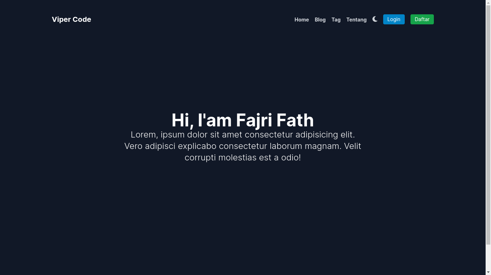

# Blog UI Web

This project is a project to create a website application using the [React](https://react.dev) framework, namely [NEXT.JS](https://nextjs.org/).

As we know that [React](https://react.dev) is a web ui that doesn't have a backend yet. So here I use the backend of the [GO language](https://go.dev).

You can download the backend at: [https://github.com/aZ4ziL/blogs_api](https://github.com/aZ4ziL/blogs_api)

---

### Screenshot

